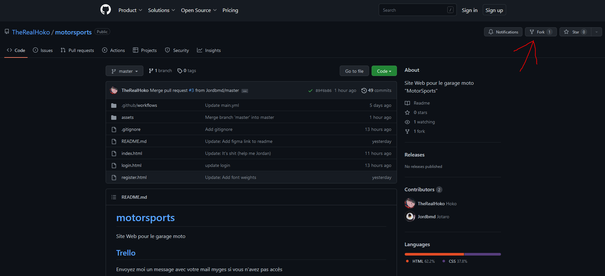
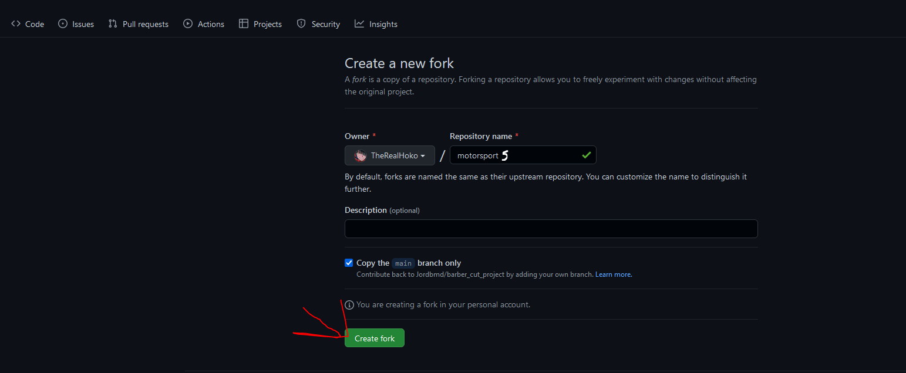

# Prérequis:
- Git

# Pour contribuer sur ce projet
Pour l'instant on a que ça comme solution pour passer en revu le code donc on a opté pour un fork et PR.

## Qu'est ce qu'un fork
C'est une copie d'un repositoire GIT (TheRealHoko/motorsports) sur son propre espace GIT ([Ton pseudo]/motorsports)afin de faire des modification sur le projet de son côté et de synchroniser les récentes modifications. Quand t'as une feature prête tu peux faire un PR sur le repo de base (TheRealHoko/motorsports).

Etape 1: 

Etape 2: 


## J'ai fork, je fais quoi maintenant ?
Sur ton terminal:

Remplace PSEUDO par ton pseudo
```
git clone git@github.com:{PSEUDO}/motorsports.git
```
Voila t'as le projet sur ton PC

## Qu'est ce qu'un PR
Pull request (PR) permet d'intégrer tes modifications sur le projet de base. Je vérifie les modifications et si il y a une erreur on fix avant que les modifications soient intégrées.